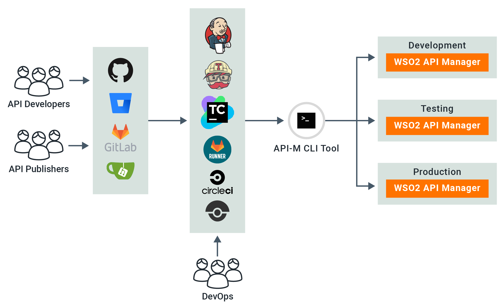
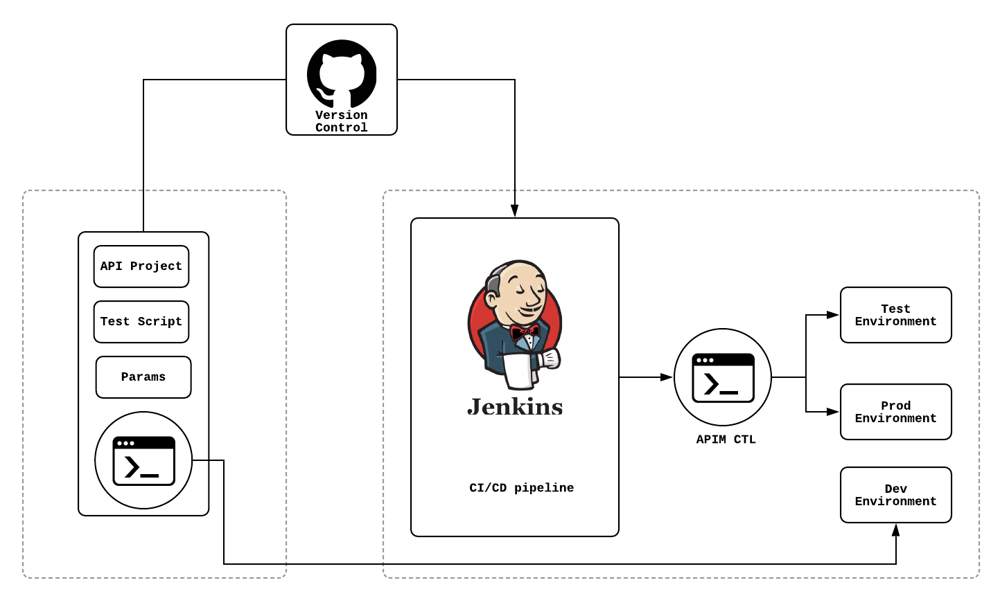

CICD Pipeline for WSO2 API Manager / Enterprise Integration

Following guidlines will help you to determine the how to setup CICD pipleline for WSO2 APIM and Integration, we call this API platform.

APIs have become the defacto for connecting apps, services and data. Organizations have multiple environments such as 
Dev, Test and Prod for different purposes. Therefore, the APIs and integration goes hand to hand and  need to be available 
in each environment after developers specify the required conditions. This process will be hugely, reduce the manually promoting APIs, integration artifacts between environments which is a tedious, error-prone, and 
time-consuming task

## Solution

For this demonstration the following architecture will be used.

## Prerequisites

1. Deploy the backend server
2. Install the Jenkins server
3. Install WSO2 API Manager
4. Install WSO2 Enterprise Integrator

### 1. Setup hosts for deployment

You need to setup following at the hosts for domain mappings
* <<host>> dev.apim.com  prod.apim.com
* <<host>> dev.be.com  prod.be.com
* <<host>> dev.ei.com  prod.ei.com

### 2. Deploy the backend server

Sample user service is used as the backend server and the complete source code of that server can be found 
[here](backend_server). Note that this is a Spring Boot application and the following commands can be used to start 
or build the application

* Start the application : `mvn spring-boot:run`
* Build the application : `mvn clean install`
